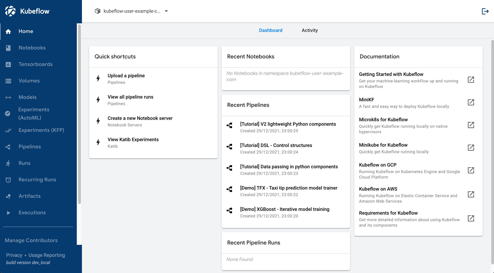

# Deploy Kubeflow to DigitalOcean Kubernetes (DOKS)

This tutorial will walk you through deploying Kubeflow to DigitalOcean Kubernetes (DOKS).

## Getting Started

### Preparation

#### Create Account on [DigitalOcean](https://www.digitalocean.com/)

you should have a DigitalOcean account first for this tutorial.

#### Install command line tools

Some CLI tools are required to run this tutorial:

- [doctl](https://docs.digitalocean.com/reference/doctl/)
  - Allows you to manage DigitalOcean resources
- [kubectl](https://kubernetes.io/docs/tasks/tools/#kubectl)
  - Allows you to manage Kubernetes clusters
- [kustomize@v3.2.0](https://github.com/kubernetes-sigs/kustomize/releases/tag/v3.2.0)
  - help to customize kubernetes manifests
  - kubeflow official manifests are in kustomize format
  - ⚠️ [Kubeflow 1.4.0 is not compatible with the latest versions of of kustomize 4.x](https://github.com/kubeflow/manifests/tree/master#prerequisites)

Here is a simple script to install all the tools on **macOS** with Homebrew

```sh
# doctl
brew install doctl

# kubectl
brew install kubectl

# kustomize
# install kustomize v3.2.0 binary from github release
# <YOUR_PATH> should the one of the your shell path, check it by `echo $PATH`
curl -fsSL https://github.com/kubernetes-sigs/kustomize/releases/download/v3.2.0/kustomize_3.2.0_darwin_amd64 -o <YOUR_PATH>/kustomize
chmod +x <YOUR_PATH>/kustomize

# verify installation
doctl version
kubectl version
kustomize version
```

### Setup DigitalOcean Kubernetes cluster

#### Login DigitalOcean with doctl

```sh
# sign in to DigitalOcean
doctl auth init

# you should see account info after signing in
doctl account get
```

#### Provision DOKS cluster

```sh
doctl kubernetes cluster create kubeflow-challenge \
  --version 1.21.5-do.0 \
  --region sgp1 \
  --size s-4vcpu-8gb-intel \
  --count 3 \
  --ha \
  --1-clicks metrics-server \
  --wait=false
```

The `wait` flag is set to false to avoid waiting for the cluster to be ready.

You can use `doctl kubernetes cluster list` to check the status of the cluster.

Once the status is `running`, you can go to the next step.

```
❯ doctl kubernetes cluster list
ID                                      Name                  Region    Version        Auto Upgrade    Status          Node Pools
8d0c1794-b8be-4007-9458-13206163ab3f    kubeflow-challenge    sgp1      1.21.5-do.0    false           provisioning    kubeflow-challenge-default-pool
```

#### Setup kubeconfig context

If you follow the above steps, `doctl` should already create a kubeconfig context for you.

You can check it with `kubectl config current-context` command.

In case you don't have the DOKS kubeconfig context, you can update it with `doctl kubernetes cluster kubeconfig save <YOUR_DOKS_ID>` command.

Check your cluster is ready with `kubectl get nodes` command. It should be `Ready` status.

```
❯ kubectl get nodes
NAME                                    STATUS   ROLES    AGE   VERSION
kubeflow-challenge-default-pool-u6l1j   Ready    <none>   12m   v1.21.5
kubeflow-challenge-default-pool-u6l1o   Ready    <none>   12m   v1.21.5
kubeflow-challenge-default-pool-u6l1r   Ready    <none>   12m   v1.21.5
```

### Install Kubeflow

#### Clone kubeflow manifests repo

```sh
git clone https://github.com/kubeflow/manifests.git
cd manifests
```

#### Install common services

```sh
# cert-manager
kustomize build common/cert-manager/cert-manager/base | kubectl apply -f -
kustomize build common/cert-manager/kubeflow-issuer/base | kubectl apply -f -

# istio
kustomize build common/istio-1-9/istio-crds/base | kubectl apply -f -
kustomize build common/istio-1-9/istio-namespace/base | kubectl apply -f -
kustomize build common/istio-1-9/istio-install/base | kubectl apply -f -

# dex
kustomize build common/dex/overlays/istio | kubectl apply -f -

# oidc-authservice
kustomize build common/oidc-authservice/base | kubectl apply -f -

# knative serving and eventing
kustomize build common/knative/knative-serving/base | kubectl apply -f -
kustomize build common/istio-1-9/cluster-local-gateway/base | kubectl apply -f -
kustomize build common/knative/knative-eventing/base | kubectl apply -f -

# kubeflow
kustomize build common/kubeflow-namespace/base | kubectl apply -f -
kustomize build common/kubeflow-roles/base | kubectl apply -f -
kustomize build common/istio-1-9/kubeflow-istio-resources/base | kubectl apply -f -
```

#### Install Kubeflow official components

```sh
#  kubeflow pipeline
kustomize build apps/pipeline/upstream/env/platform-agnostic-multi-user-pns | kubectl apply -f -

# kfserving
kustomize build apps/kfserving/upstream/overlays/kubeflow | kubectl apply -f -

# katib
kustomize build apps/katib/upstream/installs/katib-with-kubeflow | kubectl apply -f -

# dashboard
kustomize build apps/centraldashboard/upstream/overlays/istio | kubectl apply -f -

# admission webhook
kustomize build apps/admission-webhook/upstream/overlays/cert-manager | kubectl apply -f -

# jupyter notebook
kustomize build apps/jupyter/notebook-controller/upstream/overlays/kubeflow | kubectl apply -f -
kustomize build apps/jupyter/jupyter-web-app/upstream/overlays/istio | kubectl apply -f -

# Kubeflow Access-Management (KFAM)
kustomize build apps/profiles/upstream/overlays/kubeflow | kubectl apply -f -

# volumes web app
kustomize build apps/volumes-web-app/upstream/overlays/istio | kubectl apply -f -

# tensorboard
kustomize build apps/tensorboard/tensorboards-web-app/upstream/overlays/istio | kubectl apply -f -
kustomize build apps/tensorboard/tensorboard-controller/upstream/overlays/kubeflow | kubectl apply -f -

# training operator
kustomize build apps/training-operator/upstream/overlays/kubeflow | kubectl apply -f -

# MPI operator
kustomize build apps/mpi-job/upstream/overlays/kubeflow | kubectl apply -f -

# user namespace
kustomize build common/user-namespace/base | kubectl apply -f -
```

#### Verify Kubeflow installation

Run `kubectl get deployment --namespace kubeflow` to check the status of the Kubeflow deployment

You should see the following:

```
❯ kubectl get deployment --namespace kubeflow
NAME                                        READY   UP-TO-DATE   AVAILABLE   AGE
admission-webhook-deployment                1/1     1            1           42m
cache-deployer-deployment                   1/1     1            1           48m
cache-server                                1/1     1            1           48m
centraldashboard                            1/1     1            1           43m
jupyter-web-app-deployment                  1/1     1            1           41m
katib-controller                            1/1     1            1           45m
katib-db-manager                            1/1     1            1           45m
katib-mysql                                 1/1     1            1           45m
katib-ui                                    1/1     1            1           45m
kfserving-models-web-app                    1/1     1            1           45m
kubeflow-pipelines-profile-controller       1/1     1            1           48m
metadata-envoy-deployment                   1/1     1            1           48m
metadata-grpc-deployment                    1/1     1            1           48m
metadata-writer                             1/1     1            1           48m
minio                                       1/1     1            1           48m
ml-pipeline                                 1/1     1            1           48m
ml-pipeline-persistenceagent                1/1     1            1           48m
ml-pipeline-scheduledworkflow               1/1     1            1           48m
ml-pipeline-ui                              1/1     1            1           48m
ml-pipeline-viewer-crd                      1/1     1            1           48m
ml-pipeline-visualizationserver             1/1     1            1           48m
mpi-operator                                1/1     1            1           38m
mysql                                       1/1     1            1           48m
notebook-controller-deployment              1/1     1            1           42m
profiles-deployment                         1/1     1            1           41m
tensorboard-controller-controller-manager   1/1     1            1           40m
tensorboards-web-app-deployment             1/1     1            1           40m
training-operator                           1/1     1            1           39m
volumes-web-app-deployment                  1/1     1            1           41m
workflow-controller                         1/1     1            1           48m
```

#### Access Kubeflow Dashboard

Try `kubectl port-forward svc/istio-ingressgateway -n istio-system 8080:80`.

Open your browser and visit http://localhost:8080.

And then login with default email `user@example.com` and default password `12341234`.

You should see something like this:



## Resources

- [Kubernetes-Starter-Kit-Developers/01-setup-DOKS](https://github.com/digitalocean/Kubernetes-Starter-Kit-Developers/tree/main/01-setup-DOKS)
- [kubeflow/manifests](https://github.com/kubeflow/manifests)
